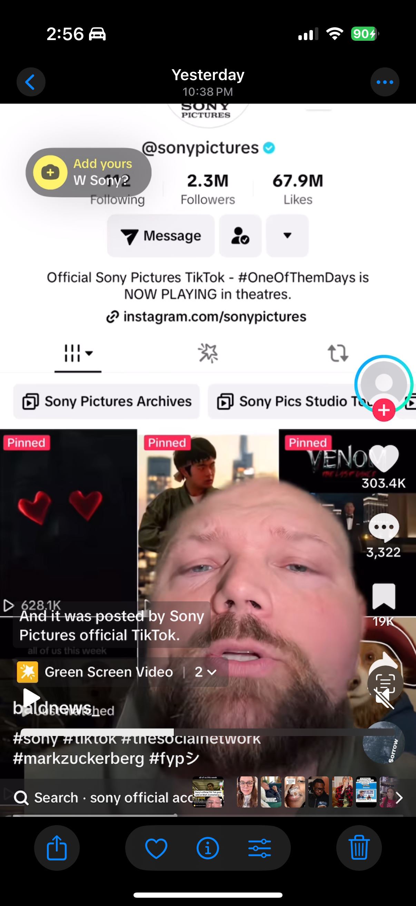
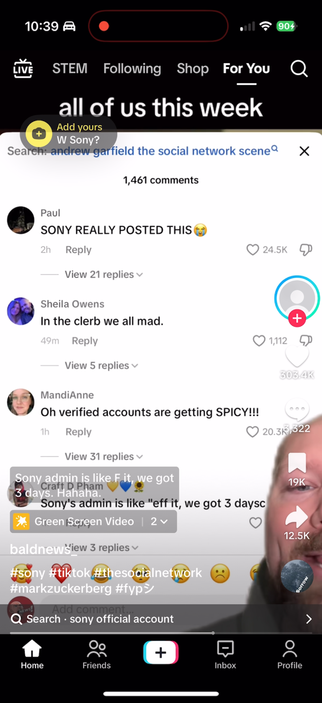

# Foreward
I’m autistic and have ADHD. That’s a loaded statement, I know, but it’s key to understanding why these next words might sound like I’m writing a tear-stained eulogy for an app. My emotions come in big, bold waves, and my brain often deals in extremes -- some call it black-and-white thinking. I also think in images and am forced to decode them into subpar textual representations to communicate with the world. It goes both ways -- sometimes I struggle to parse what people are saying because I literally need the full picture and the words alone aren’t enough.

This piece is the window into my mind I wish I’d had when I first realized I experience the world differently. To me, TikTok was never just an app. It was a community, a support system, a place where I found people who thought and felt as I do. Losing it meant losing a whole network of inside jokes and genuine empathy.

Yes, this might read as melodramatic if you’re simply here for short-form memes. But if the idea of losing your digital safe space strikes a nerve -- if you’ve ever relied on an online corner of the world to feel understood -- then these words are my “message in a bottle.” Welcome. I hope they resonate.

# **A Firsthand Requiem for the TikTok Ban (January 19th, 2025)**

I vowed to scroll until the universe unraveled -- or my thumbs cramped -- whichever came first. Videos from the corners of my carefully curated niches danced across the screen: cozy glimpses of fuzzy-sock moments before a warm fire, comedic outbursts that soared with shrieking laughter, and heartfelt confessions spiraling into tears that lulled me into a strange comfort. They all glowed with an uncanny aliveness, like twinkling constellations in a night sky we once believed infinite.

Yet each echo of hilarity coiled into a lamentation as communities splintered and drifted like exiled dreamers. These bands of misfits and enthusiasts had no chieftain, no official council -- just an algorithm weaving human yearnings into accidental kinship. As though the code itself had whispered, *Come hither, all ye who share the same unhinged sense of humor and an oddly specific hobby*, and we responded in droves.

Each cherished memory, once gleaming with the potential of real human connection, withered under the knowledge that so many pockets of support -- communities for every possible condition, identity, or brand of quirk -- were about to be ripped from us. Watching them vanish felt akin to witnessing the Library of Alexandria go up in flames, the footsteps of ancient scholars forever silenced. I could see the recollections swirl in my mind’s eye -- those short, ephemeral clips that had softened me as a person, taught me empathy, and let me see inside the kaleidoscope of other souls. Soon, they’d be gone, too, digital dust drifting on the wind.

I sank into the safe harbor of my own head, disassociating in that distinctly *stoned ADHD & autistic* way -- like rummaging through a basement full of misfiled memories and half-finished thoughts. Whirring illusions danced by, and in the periphery, I spotted a shape: *How would she die?* My inner voice -- yours truly, your beloved narrator -- read the question in a hush. Would TikTok slip away in an instantaneous hush, like a power switch flicked to “off”? Or would she be forced to endure a drawn-out farewell, each feature flickering out in slow agony while her faithful scrollers stood vigil, craving one last taste of childlike wonder?

The adult world is so good at smothering us with responsibilities and judgments. We hoist up our insecurities with precision, trying not to let them show, but that brand of perfection, I’ve heard, is mostly imaginary. I mused on how easily those childhood fears creep back, how shame about not being “enough” lingers, how we mask ourselves in public. Yeah, good times.

I jolted from my introspection -- my screen was still looping that video, the anxious orbit of my thumb picking at my scalp in tandem. It’s a vile habit, but the sensory meltdown of wearing hats in less-than-ideal temperature and humidity is… unbearable. 

Anyway, I glimpsed the next video. It was the one where I learned about “masking.” I tapped to scroll onward -- then the phone buzzed. *Attention:* TikTok will shut down tonight at 8:30.

I scrolled with feverish abandon, refreshing my feed. Every snippet was a eulogy. Laughs, tears, and frantic goodbyes became my new lullaby. A candlelight vigil for TikTok flickered in a park in NYC.

Hours passed. I felt her life draining away. First, the like and comment counts vanished, replaced by zeroes creeping in like shadows. Soon, some comments wouldn’t load at all, proclaiming me “offline” when I was anything but. Then, my personal playlists refused to appear -- as though her neurons were dimming and she couldn’t remember my name.

She was dying in my arms. And all I could do was watch.

At last, the feed coughed up one final video. Time collapsed into a single, breathless moment. *Is this it?* I tapped the screen with the trepidation of a child poking a dead bird, expecting it to move but half-fearing it wouldn’t. The feed rubber-banded, unyielding, a silent confirmation that the end was near. My internet connection was perfectly fine -- unfortunately for me. I tried in vain to salvage the video, to preserve it. Screen capture would have to suffice. My heart pounded against my ribs, a twisted medley of excitement, grief, and reluctant acceptance.

In that moment, I realized the ephemeral nature of every platform we hold dear. This new digital diaspora reminded me of the relics of Vine, Myspace, Xanga, AIM, ICQ -- empires long since crumbled into archaic code. We drift like nomads, carrying intangible relics of our past: dusty chat logs, half-remembered memes, and the faint echo of the first time someone typed “lol.” Each diaspora grows a touch easier to endure, maybe, but never less painful.

And so I pressed play:

1...
 
2...
 
3...

A ghost of our collective past flickered into being one final time. And then -- nothing. She was gone.

We will rebuild ourselves in the unknown corners of the digital wilderness. Such is our collective destiny in an era where bytes become the ephemeral breath of culture, where we float from platform to platform cradling our inside jokes and deep connections. But for now, I hold this final snapshot of our grand library, a testament to the mad, beautiful, and gloriously unfiltered world of TikTok.

Farewell, dear friend. In the hush that follows, we mourn.

